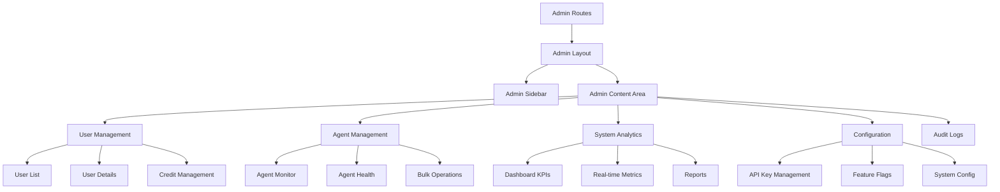

# Admin Panel Frontend Design Document

## Overview

This design document outlines the comprehensive frontend implementation for the admin panel of the AI Calling Agent SaaS platform. The backend admin functionality is already fully implemented with enterprise-level features. This frontend will provide administrators with an intuitive, secure, and powerful interface to manage the entire platform.

The admin panel will be seamlessly integrated into the existing React application, reusing existing components and maintaining design consistency while providing advanced administrative capabilities.

## Architecture

### High-Level Architecture



### Component Hierarchy

```
AdminPanel/
├── AdminLayout.tsx              # Main admin layout wrapper
├── AdminSidebar.tsx            # Admin navigation sidebar
├── AdminHeader.tsx             # Admin header with user info
├── AdminDashboard.tsx          # Admin dashboard overview
├── UserManagement/
│   ├── UserList.tsx            # Paginated user list
│   ├── UserDetails.tsx         # Individual user details
│   ├── UserEditModal.tsx       # User editing modal
│   ├── CreditAdjustModal.tsx   # Credit adjustment modal
│   └── UserStatusToggle.tsx    # User status toggle
├── AgentManagement/
│   ├── AgentList.tsx           # All agents across users
│   ├── AgentMonitor.tsx        # Real-time agent monitoring
│   ├── AgentHealthCheck.tsx    # Agent health dashboard
│   ├── BulkAgentActions.tsx    # Bulk operations interface
│   └── AgentDetailsModal.tsx   # Agent details modal
├── SystemAnalytics/
│   ├── AnalyticsDashboard.tsx  # Main analytics view
│   ├── SystemMetrics.tsx       # System-wide metrics
│   ├── UsageCharts.tsx         # Usage pattern charts
│   └── ReportGenerator.tsx     # Custom report builder
├── Configuration/
│   ├── APIKeyManager.tsx       # ElevenLabs API key management
│   ├── FeatureFlagManager.tsx  # Feature flag controls
│   ├── SystemSettings.tsx      # System configuration
│   └── UserTierManager.tsx     # User tier management
├── AuditLogs/
│   ├── AuditLogList.tsx        # Audit log viewer
│   ├── AuditLogFilter.tsx      # Log filtering interface
│   └── AuditLogDetails.tsx     # Detailed log view
└── shared/
    ├── AdminTable.tsx          # Reusable admin table
    ├── AdminCard.tsx           # Admin dashboard cards
    ├── AdminModal.tsx          # Admin modal wrapper
    ├── AdminButton.tsx         # Admin action buttons
    └── AdminCharts.tsx         # Chart components
```

## Components and Interfaces

### Core Admin Components

#### AdminLayout Component
```typescript
interface AdminLayoutProps {
  children: React.ReactNode;
  title?: string;
  breadcrumbs?: BreadcrumbItem[];
  actions?: React.ReactNode;
}

interface BreadcrumbItem {
  label: string;
  href?: string;
}
```

**Features:**
- Consistent layout wrapper for all admin pages
- Breadcrumb navigation
- Page title management
- Action button area
- Responsive design with collapsible sidebar

#### AdminSidebar Component
```typescript
interface AdminSidebarProps {
  activeSection: string;
  onSectionChange: (section: string) => void;
  userRole: 'admin' | 'super_admin';
}

interface AdminMenuItem {
  id: string;
  label: string;
  icon: React.ComponentType;
  href: string;
  requiredRole?: 'admin' | 'super_admin';
  badge?: string | number;
  children?: AdminMenuItem[];
}
```

**Features:**
- Role-based menu visibility
- Real-time notification badges
- Collapsible sub-menus
- Active state management
- Consistent with existing sidebar design

### User Management Components

#### UserList Component
```typescript
interface UserListProps {
  searchQuery?: string;
  filters?: UserFilters;
  onUserSelect: (user: User) => void;
}

interface UserFilters {
  role?: 'user' | 'admin' | 'super_admin';
  status?: 'active' | 'inactive';
  registrationDate?: DateRange;
  creditRange?: NumberRange;
}

interface UserListItem {
  id: string;
  name: string;
  email: string;
  role: string;
  status: 'active' | 'inactive';
  registrationDate: Date;
  lastLogin?: Date;
  agentCount: number;
  callCount: number;
  creditsUsed: number;
  creditsRemaining: number;
}
```

**Features:**
- Paginated user list with virtual scrolling
- Advanced search and filtering
- Sortable columns
- Bulk selection for operations
- Real-time status updates

#### UserDetails Component
```typescript
interface UserDetailsProps {
  userId: string;
  onClose: () => void;
  onUpdate: (user: User) => void;
}

interface UserDetailsData {
  user: User;
  statistics: {
    totalAgents: number;
    totalCalls: number;
    totalCreditsUsed: number;
    averageCallDuration: number;
    successRate: number;
  };
  recentActivity: ActivityItem[];
  agents: AgentSummary[];
}
```

**Features:**
- Comprehensive user information display
- Usage statistics and charts
- Recent activity timeline
- Agent management interface
- Credit adjustment tools

### Agent Management Components

#### AgentMonitor Component
```typescript
interface AgentMonitorProps {
  timeframe: '1h' | '24h' | '7d' | '30d';
  onTimeframeChange: (timeframe: string) => void;
}

interface AgentMonitorData {
  totalAgents: number;
  activeAgents: number;
  healthyAgents: number;
  topPerformingAgents: AgentPerformance[];
  systemMetrics: SystemMetrics;
  alertsAndIssues: Alert[];
}
```

**Features:**
- Real-time agent monitoring dashboard
- Performance metrics visualization
- Health status indicators
- Alert management
- Timeframe selection

#### BulkAgentActions Component
```typescript
interface BulkAgentActionsProps {
  selectedAgents: string[];
  onActionComplete: (results: BulkActionResults) => void;
}

interface BulkActionResults {
  successful: number;
  failed: Array<{
    agentId: string;
    error: string;
  }>;
}
```

**Features:**
- Multi-select agent interface
- Bulk activate/deactivate operations
- Progress tracking
- Error handling and reporting
- Confirmation dialogs

### Configuration Management Components

#### APIKeyManager Component
```typescript
interface APIKeyManagerProps {
  onKeyUpdate: (keyId: string, config: APIKeyConfig) => void;
}

interface APIKeyConfig {
  id: string;
  name: string;
  key: string; // Masked for security
  isDefault: boolean;
  assignedUsers: string[];
  usageStats: {
    totalCalls: number;
    remainingQuota: number;
    costThisMonth: number;
  };
  status: 'active' | 'inactive' | 'error';
}
```

**Features:**
- Secure API key management
- User assignment interface
- Usage tracking and quotas
- Default key configuration
- Key rotation tools

#### FeatureFlagManager Component
```typescript
interface FeatureFlagManagerProps {
  onFlagUpdate: (flagId: string, config: FeatureFlagConfig) => void;
}

interface FeatureFlagConfig {
  id: string;
  name: string;
  description: string;
  isEnabled: boolean;
  scope: 'global' | 'user' | 'tier';
  targetUsers?: string[];
  targetTiers?: string[];
  rolloutPercentage?: number;
}

interface ProprietaryFeature {
  id: 'dashboard_kpis' | 'agent_analytics' | 'advanced_reports';
  name: string;
  description: string;
  defaultEnabled: boolean;
  tierRestrictions: string[];
}
```

**Features:**
- Proprietary feature management (KPIs, analytics)
- User-level feature toggles
- Tier-based feature access
- Rollout percentage controls
- Bulk feature operations

## Data Models

### Admin User Interface
```typescript
interface AdminUser extends User {
  adminRole: 'admin' | 'super_admin';
  permissions: AdminPermission[];
  lastAdminAction?: Date;
  adminActionCount: number;
}

interface AdminPermission {
  resource: string;
  actions: string[];
}
```

### System Statistics Interface
```typescript
interface SystemStatistics {
  users: {
    total: number;
    active: number;
    newThisMonth: number;
    byTier: Record<string, number>;
  };
  agents: {
    total: number;
    active: number;
    byType: Record<string, number>;
    healthyPercentage: number;
  };
  calls: {
    totalThisMonth: number;
    successRate: number;
    averageDuration: number;
    costThisMonth: number;
  };
  system: {
    uptime: number;
    responseTime: number;
    errorRate: number;
    activeConnections: number;
  };
}
```

### Audit Log Interface
```typescript
interface AuditLogEntry {
  id: string;
  adminUserId: string;
  adminUserEmail: string;
  action: string;
  resourceType: string;
  resourceId?: string;
  targetUserId?: string;
  targetUserEmail?: string;
  details: Record<string, any>;
  ipAddress: string;
  userAgent: string;
  timestamp: Date;
  success: boolean;
  errorMessage?: string;
}
```

## Error Handling

### Admin Error Boundaries
```typescript
interface AdminErrorBoundaryState {
  hasError: boolean;
  error?: Error;
  errorInfo?: ErrorInfo;
  errorId: string;
}

class AdminErrorBoundary extends Component<Props, AdminErrorBoundaryState> {
  // Enhanced error handling for admin operations
  // Automatic error reporting
  // Graceful fallbacks for critical admin functions
}
```

### Error Recovery Strategies
- **Network Errors**: Automatic retry with exponential backoff
- **Permission Errors**: Clear messaging and role verification
- **Data Errors**: Validation feedback and correction suggestions
- **System Errors**: Fallback to read-only mode when possible

## Testing Strategy

### Unit Testing
```typescript
// Example test structure
describe('AdminUserList', () => {
  it('should display paginated user list', () => {});
  it('should handle search and filtering', () => {});
  it('should support bulk operations', () => {});
  it('should handle permission-based visibility', () => {});
});

describe('APIKeyManager', () => {
  it('should mask sensitive API keys', () => {});
  it('should handle user assignment', () => {});
  it('should track usage statistics', () => {});
});
```

### Integration Testing
- **API Integration**: Test all admin API endpoints
- **Permission Testing**: Verify role-based access controls
- **Data Flow**: Test data consistency across components
- **Error Scenarios**: Test error handling and recovery

### E2E Testing
- **Admin Workflows**: Complete admin task scenarios
- **Security Testing**: Unauthorized access attempts
- **Performance Testing**: Large dataset handling
- **Cross-browser Testing**: Admin panel compatibility

## Security Considerations

### Authentication and Authorization
```typescript
// Admin route protection
const AdminRoute: React.FC<AdminRouteProps> = ({ children, requiredRole = 'admin' }) => {
  const { user } = useAuth();
  
  if (!user || !isAdminUser(user)) {
    return <Navigate to="/dashboard" replace />;
  }
  
  if (requiredRole === 'super_admin' && !isSuperAdmin(user)) {
    return <UnauthorizedAccess />;
  }
  
  return <>{children}</>;
};
```

### Data Security
- **Sensitive Data Masking**: API keys, tokens, personal information
- **Audit Trail**: All admin actions logged with full context
- **Session Management**: Enhanced session validation for admin users
- **CSRF Protection**: Additional CSRF tokens for admin operations

### Permission Management
```typescript
interface AdminPermissions {
  canViewUsers: boolean;
  canEditUsers: boolean;
  canManageCredits: boolean;
  canViewAgents: boolean;
  canManageAgents: boolean;
  canViewAuditLogs: boolean;
  canManageSystem: boolean;
  canManageAPIKeys: boolean;
  canManageFeatureFlags: boolean;
}

const useAdminPermissions = (): AdminPermissions => {
  const { user } = useAuth();
  return calculatePermissions(user);
};
```

## Performance Optimization

### Data Loading Strategies
- **Lazy Loading**: Load admin data only when needed
- **Pagination**: Efficient handling of large datasets
- **Caching**: Strategic caching of frequently accessed data
- **Virtual Scrolling**: Handle large lists efficiently

### Real-time Updates
```typescript
// WebSocket integration for real-time admin updates
const useAdminRealTimeUpdates = () => {
  const [socket, setSocket] = useState<WebSocket | null>(null);
  
  useEffect(() => {
    const ws = new WebSocket('/admin/ws');
    ws.onmessage = (event) => {
      const update = JSON.parse(event.data);
      handleRealTimeUpdate(update);
    };
    setSocket(ws);
    
    return () => ws.close();
  }, []);
};
```

### Memory Management
- **Component Cleanup**: Proper cleanup of admin components
- **Event Listener Management**: Clean up event listeners
- **Cache Management**: Intelligent cache invalidation

## Integration with Existing System

### Routing Integration
```typescript
// Enhanced App.tsx with admin routes
const App = () => {
  return (
    <Router>
      <Routes>
        {/* Existing routes */}
        <Route path="/" element={<Index />} />
        <Route path="/dashboard" element={<ProtectedRoute><Dashboard /></ProtectedRoute>} />
        
        {/* New admin routes */}
        <Route path="/admin/*" element={
          <AdminRoute>
            <AdminPanel />
          </AdminRoute>
        } />
      </Routes>
    </Router>
  );
};
```

### Sidebar Integration
```typescript
// Enhanced sidebar with admin section
const Sidebar = ({ user, ...props }) => {
  const isAdmin = user && (user.role === 'admin' || user.role === 'super_admin');
  
  const menuItems = [
    // Existing menu items
    ...existingMenuItems,
    
    // Admin section
    ...(isAdmin ? [{
      id: 'admin',
      label: 'Admin Panel',
      icon: Shield,
      href: '/admin',
      badge: adminNotificationCount
    }] : [])
  ];
  
  return (
    // Existing sidebar implementation with admin items
  );
};
```

### API Service Integration
```typescript
// Enhanced API service with admin methods
class APIService {
  // Existing methods...
  
  // Admin user management
  async getAdminUsers(params: AdminUserParams) {
    return this.request('/admin/users', { params });
  }
  
  async updateAdminUser(userId: string, data: AdminUserUpdate) {
    return this.request(`/admin/users/${userId}`, {
      method: 'PUT',
      data
    });
  }
  
  // Admin agent management
  async getAdminAgents(params: AdminAgentParams) {
    return this.request('/admin/agents', { params });
  }
  
  // Admin system management
  async getSystemStats() {
    return this.request('/admin/stats/system');
  }
  
  async updateSystemConfig(config: SystemConfig) {
    return this.request('/admin/config', {
      method: 'PUT',
      data: config
    });
  }
}
```

## Responsive Design

### Mobile Considerations
- **Responsive Tables**: Horizontal scrolling and card layouts
- **Touch-Friendly**: Appropriate touch targets for mobile
- **Simplified Navigation**: Collapsible admin sidebar
- **Essential Features**: Prioritize critical admin functions on mobile

### Tablet Optimization
- **Split View**: Side-by-side layouts for tablets
- **Gesture Support**: Swipe navigation and actions
- **Optimized Charts**: Touch-friendly chart interactions

## Accessibility

### WCAG Compliance
- **Keyboard Navigation**: Full keyboard accessibility
- **Screen Reader Support**: Proper ARIA labels and descriptions
- **Color Contrast**: High contrast for admin interfaces
- **Focus Management**: Clear focus indicators

### Admin-Specific Accessibility
- **Data Tables**: Proper table headers and navigation
- **Form Validation**: Clear error messages and guidance
- **Modal Management**: Proper modal focus handling
- **Chart Accessibility**: Alternative text for data visualizations

This design provides a comprehensive foundation for implementing a powerful, secure, and user-friendly admin panel that seamlessly integrates with the existing application while providing advanced administrative capabilities.