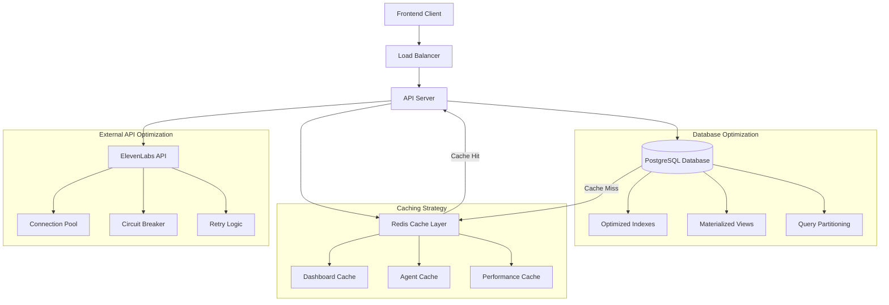

# API Performance Optimization Design

## Overview

This design document outlines the comprehensive solution for optimizing the performance of three critical APIs that are currently experiencing 10+ second response times: `/api/dashboard/overview`, `/api/dashboard/analytics`, and `/api/agents`. The solution addresses the root causes identified through database analysis and implements a multi-layered optimization strategy.

## Root Cause Analysis

### Current Performance Issues

#### 1. Dashboard Overview API (`/api/dashboard/overview`)
**Current Response Time:** 10+ seconds
**Root Causes:**
- **Complex Aggregation Queries:** Real-time calculation of KPIs from raw `calls` and `lead_analytics` tables
- **N+1 Query Pattern:** Individual queries for each agent's performance data
- **Cache Miss Handling:** Expensive fallback queries when dashboard cache is empty
- **Inefficient Recent Activity Query:** Unoptimized JOIN across multiple tables

#### 2. Dashboard Analytics API (`/api/dashboard/analytics`)
**Current Response Time:** 10+ seconds  
**Root Causes:**
- **Real-time Chart Data Generation:** Calculating 7-day trends from raw call data
- **Multiple Sequential Queries:** Separate queries for each chart dataset
- **Lead Quality Distribution Calculation:** Complex CASE statements without proper indexing
- **Missing Data Handling:** Inefficient empty data point generation

#### 3. Agents List API (`/api/agents`)
**Current Response Time:** 10+ seconds
**Root Causes:**
- **External API Dependency:** Sequential calls to ElevenLabs API for each agent configuration
- **Performance Data Calculation:** Individual database queries for each agent's statistics
- **Synchronous Processing:** Blocking operations for agent transformation
- **No Graceful Degradation:** System waits for all external calls to complete

#### 4. Comparison with Fast APIs
**Billing APIs Response Time:** <1 second
**Why They're Fast:**
- **Simple Queries:** Direct user credit lookups with primary key access
- **Minimal Joins:** Single table queries or simple foreign key relationships
- **No External Dependencies:** Pure database operations
- **Optimized Indexes:** Direct access patterns with existing indexes

## Architecture

### High-Level Architecture



### Performance Optimization Layers

#### Layer 1: Database Query Optimization
- **Composite Indexes:** Multi-column indexes for complex WHERE clauses
- **Materialized Views:** Pre-calculated aggregations for dashboard metrics
- **Query Rewriting:** Batch operations instead of N+1 patterns
- **Connection Pooling:** Efficient database connection management

#### Layer 2: In-Memory Caching
- **LRU Cache:** In-memory cache with Least Recently Used eviction policy
- **Cache Invalidation:** Event-driven cache updates using database triggers
- **Cache Warming:** Proactive cache population for critical data
- **TTL Management:** Time-to-live expiration for automatic cache refresh

#### Layer 3: External API Optimization
- **Concurrent Processing:** Parallel requests to ElevenLabs API
- **Exponential Backoff:** Retry failed requests with increasing delays
- **Graceful Degradation:** Serve basic agent data when external API fails
- **Accept API Delays:** Normal operation with ElevenLabs response times

#### Layer 4: Application-Level Optimization
- **Async Processing:** Non-blocking operations for non-critical data
- **Data Transformation Optimization:** Efficient object mapping and serialization
- **Memory Management:** Proper resource cleanup and garbage collection
- **Request Batching:** Combine multiple operations into single requests

## Components and Interfaces

### 1. Enhanced Dashboard Controller

```typescript
interface OptimizedDashboardController {
  // Optimized overview with multi-level caching
  getOverview(req: AuthenticatedRequest): Promise<DashboardOverview>
  
  // Optimized analytics with parallel data fetching
  getAnalytics(req: AuthenticatedRequest): Promise<DashboardAnalytics>
  
  // Cache management methods
  invalidateUserCache(userId: string): Promise<void>
  warmCache(userId: string): Promise<void>
}

interface DashboardOverview {
  kpis: KPIMetric[]
  credits: CreditInfo
  agents: AgentSummary
  conversations: ConversationSummary
  leads: LeadSummary
  recentActivity: ActivityItem[]
  cacheInfo: CacheMetadata
}
```

### 2. Performance-Optimized Agent Service

```typescript
interface OptimizedAgentService {
  // Batch agent fetching with parallel external API calls
  listAgentsForFrontend(userId: string): Promise<FrontendAgent[]>
  
  // Cached agent configuration retrieval
  getAgentConfiguration(userId: string, agentId: string): Promise<AgentConfig>
  
  // Batch performance data fetching
  getAgentPerformanceBatch(userId: string, agentIds: string[]): Promise<AgentPerformance[]>
  
  // External API management
  fetchElevenLabsConfigsBatch(agentIds: string[]): Promise<ElevenLabsConfig[]>
}
```

### 3. Database Query Optimizer

```typescript
interface DatabaseQueryOptimizer {
  // Optimized dashboard queries
  getDashboardKPIsOptimized(userId: string): Promise<KPIData>
  getRecentActivityOptimized(userId: string, limit: number): Promise<ActivityItem[]>
  
  // Batch agent queries
  getAgentPerformanceBatch(userId: string): Promise<AgentPerformanceMap>
  getAgentStatisticsBatch(agentIds: string[]): Promise<AgentStatistics[]>
  
  // Analytics queries
  getLeadsOverTimeOptimized(userId: string, days: number): Promise<TimeSeriesData>
  getLeadQualityDistributionOptimized(userId: string): Promise<QualityDistribution>
}
```

### 4. In-Memory Cache Manager

```typescript
interface MemoryCacheManager {
  // Dashboard caching
  getDashboardCache(userId: string): DashboardCache | null
  setDashboardCache(userId: string, data: DashboardCache, ttl: number): void
  
  // Agent caching
  getAgentCache(agentId: string): AgentCache | null
  setAgentCache(agentId: string, data: AgentCache, ttl: number): void
  
  // Performance data caching
  getPerformanceCache(userId: string): PerformanceCache | null
  setPerformanceCache(userId: string, data: PerformanceCache, ttl: number): void
  
  // Cache management
  invalidateUserCaches(userId: string): void
  invalidateAgentCaches(agentIds: string[]): void
  getCacheStats(): CacheStatistics
  clearExpiredEntries(): void
}
```

### 5. External API Retry Manager

```typescript
interface ExternalAPIManager {
  // ElevenLabs API with retry logic
  fetchAgentConfig(agentId: string): Promise<ElevenLabsConfig | null>
  fetchAgentConfigsBatch(agentIds: string[]): Promise<ElevenLabsConfig[]>
  
  // Retry management
  retryWithBackoff<T>(operation: () => Promise<T>, maxRetries: number): Promise<T | null>
  
  // Fallback strategies
  getAgentConfigFallback(agentId: string): Promise<BasicAgentConfig>
}
```

## Data Models

### 1. Optimized Database Indexes

```sql
-- Composite indexes for dashboard queries
CREATE INDEX CONCURRENTLY idx_calls_user_created_status 
ON calls(user_id, created_at DESC, status) 
WHERE created_at >= CURRENT_DATE - INTERVAL '30 days';

-- Agent analytics optimization
CREATE INDEX CONCURRENTLY idx_agent_analytics_user_date_hour 
ON agent_analytics(user_id, date DESC, hour) 
WHERE date >= CURRENT_DATE - INTERVAL '7 days';

-- Lead analytics optimization
CREATE INDEX CONCURRENTLY idx_lead_analytics_score_created 
ON lead_analytics(total_score, created_at DESC);

-- Recent activity optimization
CREATE INDEX CONCURRENTLY idx_calls_user_created_recent 
ON calls(user_id, created_at DESC) 
WHERE created_at >= CURRENT_DATE - INTERVAL '7 days';
```

### 2. Materialized Views for Dashboard KPIs

```sql
-- Materialized view for user KPI summary
CREATE MATERIALIZED VIEW user_kpi_summary AS
SELECT 
    u.id as user_id,
    u.email,
    u.credits,
    
    -- Call metrics (last 30 days)
    COALESCE(call_stats.total_calls, 0) as total_calls_30d,
    COALESCE(call_stats.successful_calls, 0) as successful_calls_30d,
    COALESCE(call_stats.success_rate, 0) as success_rate_30d,
    COALESCE(call_stats.total_duration, 0) as total_duration_30d,
    COALESCE(call_stats.avg_duration, 0) as avg_duration_30d,
    
    -- Lead metrics (last 30 days)
    COALESCE(lead_stats.total_leads, 0) as total_leads_30d,
    COALESCE(lead_stats.qualified_leads, 0) as qualified_leads_30d,
    COALESCE(lead_stats.conversion_rate, 0) as conversion_rate_30d,
    COALESCE(lead_stats.avg_score, 0) as avg_lead_score_30d,
    
    -- Agent metrics
    COALESCE(agent_stats.total_agents, 0) as total_agents,
    COALESCE(agent_stats.active_agents, 0) as active_agents,
    
    -- Cache timestamp
    CURRENT_TIMESTAMP as calculated_at
    
FROM users u
LEFT JOIN (
    SELECT 
        user_id,
        COUNT(*) as total_calls,
        COUNT(CASE WHEN status = 'completed' THEN 1 END) as successful_calls,
        CASE WHEN COUNT(*) > 0 THEN (COUNT(CASE WHEN status = 'completed' THEN 1 END) * 100.0 / COUNT(*)) ELSE 0 END as success_rate,
        SUM(duration_minutes) as total_duration,
        AVG(duration_minutes) as avg_duration
    FROM calls 
    WHERE created_at >= CURRENT_DATE - INTERVAL '30 days'
    GROUP BY user_id
) call_stats ON u.id = call_stats.user_id
LEFT JOIN (
    SELECT 
        c.user_id,
        COUNT(la.id) as total_leads,
        COUNT(CASE WHEN la.total_score >= 70 THEN 1 END) as qualified_leads,
        CASE WHEN COUNT(la.id) > 0 THEN (COUNT(CASE WHEN la.total_score >= 70 THEN 1 END) * 100.0 / COUNT(la.id)) ELSE 0 END as conversion_rate,
        AVG(la.total_score) as avg_score
    FROM calls c
    JOIN lead_analytics la ON c.id = la.call_id
    WHERE c.created_at >= CURRENT_DATE - INTERVAL '30 days'
    GROUP BY c.user_id
) lead_stats ON u.id = lead_stats.user_id
LEFT JOIN (
    SELECT 
        user_id,
        COUNT(*) as total_agents,
        COUNT(CASE WHEN is_active THEN 1 END) as active_agents
    FROM agents
    GROUP BY user_id
) agent_stats ON u.id = agent_stats.user_id
WHERE u.is_active = true;

-- Create unique index for fast lookups
CREATE UNIQUE INDEX idx_user_kpi_summary_user_id ON user_kpi_summary(user_id);
```

### 3. Cache Data Structures

```typescript
interface DashboardCache {
  userId: string
  kpis: {
    totalLeads: number
    totalInteractions: number
    leadsConverted: number
    conversionRate: number
    avgConversationsPerHour: number
    avgLeadScore: number
    callSuccessRate: number
  }
  credits: {
    current: number
    usedThisMonth: number
    remaining: number
  }
  agents: {
    total: number
    active: number
    draft: number
  }
  recentActivity: ActivityItem[]
  calculatedAt: Date
  expiresAt: Date
}

interface AgentCache {
  agentId: string
  userId: string
  basicInfo: {
    id: string
    name: string
    type: string
    status: string
    description: string
  }
  performance: {
    conversations: number
    successRate: number
    avgDuration: string
    creditsUsed: number
  }
  elevenLabsConfig?: ElevenLabsConfig
  calculatedAt: Date
  expiresAt: Date
}
```

## Error Handling

### 1. Graceful Degradation Strategy

```typescript
interface GracefulDegradationHandler {
  // Dashboard fallback strategies
  handleDashboardCacheMiss(userId: string): Promise<DashboardOverview>
  handleDatabaseTimeout(userId: string): Promise<PartialDashboardData>
  
  // Agent fallback strategies
  handleElevenLabsTimeout(agentIds: string[]): Promise<BasicAgentInfo[]>
  handlePartialAgentData(userId: string): Promise<FrontendAgent[]>
  
  // Error recovery
  scheduleDataRefresh(userId: string): Promise<void>
  notifyPerformanceIssue(endpoint: string, duration: number): Promise<void>
}
```

### 2. Retry Logic Implementation

```typescript
interface RetryConfig {
  maxRetries: number // 3 attempts
  baseDelay: number  // 1000ms
  maxDelay: number   // 4000ms
  backoffMultiplier: number // 2
}

interface RetryState {
  attempt: number
  lastAttemptTime: Date
  nextRetryDelay: number
  totalElapsed: number
}
```

### 3. Error Response Formats

```typescript
interface PerformanceError {
  success: false
  error: {
    code: 'PERFORMANCE_TIMEOUT' | 'CACHE_MISS' | 'EXTERNAL_API_RETRY_FAILED'
    message: string
    details?: string
    fallbackData?: any
    retryAttempts?: number
  }
}
```

## Testing Strategy

### 1. Performance Testing Framework

```typescript
interface PerformanceTestSuite {
  // Load testing
  testConcurrentDashboardRequests(userCount: number): Promise<PerformanceResults>
  testAgentListUnderLoad(requestsPerSecond: number): Promise<PerformanceResults>
  
  // Response time testing
  measureDashboardResponseTime(iterations: number): Promise<ResponseTimeStats>
  measureAgentListResponseTime(iterations: number): Promise<ResponseTimeStats>
  
  // Cache effectiveness testing
  testCacheHitRatio(duration: number): Promise<CacheStats>
  testCacheInvalidation(): Promise<InvalidationResults>
}

interface PerformanceResults {
  averageResponseTime: number
  p95ResponseTime: number
  p99ResponseTime: number
  throughput: number
  errorRate: number
  cacheHitRatio: number
}
```

### 2. Database Performance Testing

```sql
-- Query performance testing
EXPLAIN (ANALYZE, BUFFERS, FORMAT JSON) 
SELECT * FROM user_kpi_summary WHERE user_id = $1;

-- Index usage analysis
SELECT 
    schemaname,
    tablename,
    indexname,
    idx_scan,
    idx_tup_read,
    idx_tup_fetch
FROM pg_stat_user_indexes 
WHERE schemaname = 'public'
ORDER BY idx_scan DESC;

-- Cache hit ratio monitoring
SELECT 
    sum(heap_blks_read) as heap_read,
    sum(heap_blks_hit) as heap_hit,
    (sum(heap_blks_hit) - sum(heap_blks_read)) / sum(heap_blks_hit) as ratio
FROM pg_statio_user_tables;
```

### 3. Integration Testing

```typescript
interface IntegrationTestSuite {
  // End-to-end performance tests
  testDashboardLoadingFlow(): Promise<void>
  testAgentManagementFlow(): Promise<void>
  
  // Cache integration tests
  testCacheInvalidationFlow(): Promise<void>
  testCacheWarmingFlow(): Promise<void>
  
  // External API integration tests
  testElevenLabsFailureHandling(): Promise<void>
  testCircuitBreakerBehavior(): Promise<void>
}
```

## Implementation Phases

### Phase 1: Database Optimization (Week 1)
1. **Index Creation:** Add composite indexes for critical queries
2. **Materialized Views:** Create and populate KPI summary views
3. **Query Optimization:** Rewrite slow queries using batch operations
4. **Connection Pooling:** Implement database connection optimization

### Phase 2: Caching Layer (Week 2)
1. **Redis Setup:** Configure Redis for application caching
2. **Cache Implementation:** Add caching to dashboard and agent endpoints
3. **Cache Invalidation:** Implement event-driven cache updates
4. **Cache Warming:** Add proactive cache population

### Phase 3: External API Optimization (Week 3)
1. **Circuit Breaker:** Implement circuit breaker for ElevenLabs API
2. **Parallel Processing:** Add concurrent external API calls
3. **Response Caching:** Cache external API responses
4. **Graceful Degradation:** Implement fallback strategies

### Phase 4: Performance Monitoring (Week 4)
1. **Metrics Collection:** Add comprehensive performance monitoring
2. **Alerting:** Implement performance threshold alerts
3. **Load Testing:** Conduct comprehensive performance testing
4. **Documentation:** Create performance optimization guide

## Success Metrics

### Performance Targets
- **Dashboard Overview API:** < 2 seconds (from 10+ seconds)
- **Dashboard Analytics API:** < 2 seconds (from 10+ seconds)  
- **Agents List API:** < 1 second (from 10+ seconds)
- **Cache Hit Ratio:** > 80% for frequently accessed data
- **Concurrent User Support:** 50+ users with maintained performance

### Monitoring KPIs
- **Response Time P95:** < 2 seconds for all optimized endpoints
- **Error Rate:** < 1% for all API endpoints
- **Database Query Time:** < 500ms for complex aggregations
- **External API Timeout Rate:** < 5% for ElevenLabs calls
- **Memory Usage:** Stable memory consumption under load