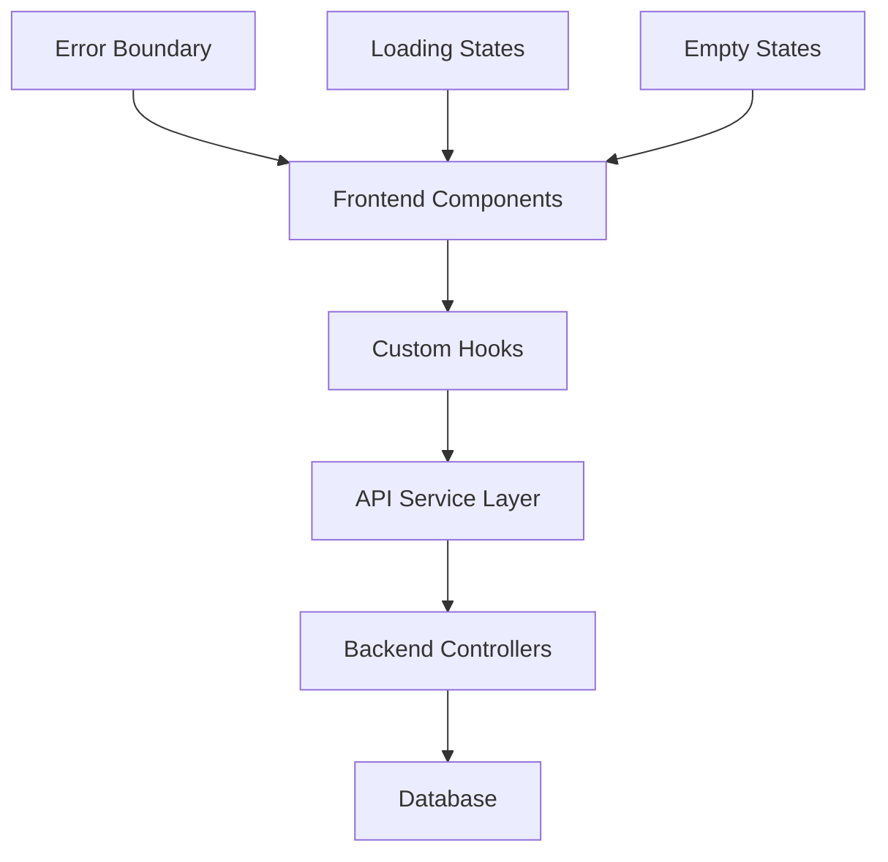

# Design Document

## Overview

This design addresses the integration issues between the frontend dashboard components and backend APIs. The main problem is that frontend components are displaying fallback/default data instead of properly consuming real data from the backend APIs. The backend already provides comprehensive endpoints with real database data, but the frontend data flow needs to be fixed to ensure proper integration.

## Architecture

### Current State Analysis

**Backend APIs (Working Correctly):**
- `/api/dashboard/overview` - Returns real KPI data from database
- `/api/dashboard/analytics` - Returns real chart data from database  
- `/api/leads` - Returns real lead data with filtering/pagination
- `/api/leads/:id` - Returns detailed lead profile data
- `/api/leads/:id/profile` - Returns comprehensive lead analytics

**Frontend Issues Identified:**
- `OverviewKPIs.tsx` - Uses `defaultKpis` fallback data when API data should be available
- `OverviewCharts.tsx` - Uses `default*Data` arrays instead of API data
- Various components use `Math.random()` for legitimate purposes (IDs, jitter) and illegitimate purposes (data generation)
- Error handling and loading states need improvement
- Data transformation between API responses and component expectations

### Target Architecture



## Components and Interfaces

### 1. Data Flow Components

#### OverviewKPIs Component
- **Current Issue:** Falls back to `defaultKpis` when `overview?.kpis` should contain real data
- **Solution:** Remove all fallback mock data and show "No data available" states when API data is empty
- **Data Source:** `/api/dashboard/overview` → `overview.kpis`

#### OverviewCharts Component  
- **Current Issue:** Uses `default*Data` arrays instead of API analytics data
- **Solution:** Remove all default mock data arrays and show empty state messages when no real data is available
- **Data Source:** `/api/dashboard/analytics` → `analytics.*Data`

#### Lead Data Components (CallData, ChatData)
- **Current Issue:** May not be properly integrated with leads API
- **Solution:** Ensure proper integration with `/api/leads` endpoint
- **Data Source:** `/api/leads` with filtering and pagination

### 2. Hook Layer Improvements

#### useDashboard Hook
- **Current State:** Already implemented with proper API calls
- **Improvements Needed:** 
  - Better error state management
  - Ensure data transformation is correct
  - Add debug logging for data flow issues

#### useLeads Hook (New)
- **Purpose:** Manage leads data fetching with filtering and pagination
- **API Integration:** `/api/leads` endpoint
- **Features:** Search, filter, sort, paginate

### 3. API Service Layer

#### Current State
- `apiService.ts` already has proper methods implemented
- Error handling and retry logic in place
- Token refresh mechanism working

#### Improvements Needed
- Add debug logging for API responses
- Ensure response data structure matches component expectations
- Add type validation for API responses

## Data Models

### Dashboard Overview Data Structure
```typescript
interface DashboardOverview {
  kpis: Array<{
    label: string;
    value: number | string;
    delta?: number;
    compare?: string;
    description: string;
    percentage?: number;
    efficiency?: string;
  }>;
  credits: {
    current: number;
    usedThisMonth: number;
    remaining: number;
  };
  agents: {
    total: number;
    active: number;
    draft: number;
  };
  // ... other fields
}
```

### Dashboard Analytics Data Structure
```typescript
interface DashboardAnalytics {
  leadsOverTimeData: Array<{
    date: string;
    chatLeads: number;
    callLeads: number;
    total: number;
  }>;
  interactionsOverTimeData: Array<{
    date: string;
    chat: number;
    call: number;
    total: number;
  }>;
  leadQualityData: Array<{
    name: string;
    chatCount: number;
    callCount: number;
    color: string;
  }>;
  // ... other chart data arrays
}
```

## Error Handling

### Error State Management
1. **API Errors:** Display user-friendly error messages with retry buttons
2. **Network Errors:** Show network connectivity issues with retry options
3. **Data Validation Errors:** Log validation issues and show "No data available" states
4. **Empty Data:** Show "No data available" messages instead of any mock/fallback data

### Loading State Management
1. **Initial Load:** Show skeleton loaders for all dashboard components
2. **Refresh Operations:** Show refresh indicators without hiding existing data
3. **Filter Changes:** Show loading states for chart updates
4. **Pagination:** Show loading states for table data updates

## Testing Strategy

### Unit Tests
1. **Component Tests:** Verify components render correctly with real API data
2. **Hook Tests:** Test data fetching, error handling, and loading states
3. **API Service Tests:** Test API integration and error scenarios
4. **Data Transformation Tests:** Verify API response data is correctly transformed

### Integration Tests
1. **End-to-End Data Flow:** Test complete data flow from API to UI
2. **Error Scenarios:** Test error handling and recovery
3. **Loading States:** Test loading state behavior
4. **Filter and Pagination:** Test real-time data updates

### Manual Testing Checklist
1. **Dashboard KPIs:** Verify real data displays correctly
2. **Analytics Charts:** Verify charts show real data and update with filters
3. **Lead Tables:** Verify lead data loads and filtering works
4. **Lead Profiles:** Verify detailed lead data displays correctly
5. **Error States:** Verify error handling works as expected
6. **Loading States:** Verify loading indicators appear appropriately

## Implementation Approach

### Phase 1: Data Flow Analysis and Debugging
1. Add comprehensive logging to identify where data flow breaks
2. Verify API responses match expected data structures
3. Check component data consumption patterns

### Phase 2: Component Data Integration Fixes
1. Remove all fallback/default mock data from OverviewKPIs and show "No data available" when API data is empty
2. Remove all default mock data arrays from OverviewCharts and show empty states when no real data exists
3. Ensure lead components show "No data available" instead of any mock data when API returns empty results

### Phase 3: Math.random() Usage Review
1. Audit all Math.random() usage in the codebase
2. Replace inappropriate usage with proper alternatives
3. Preserve legitimate usage (jitter, animations, IDs)

### Phase 4: Error Handling and UX Improvements
1. Implement proper error boundaries and error states
2. Add comprehensive loading states
3. Add empty state handling with helpful messages

### Phase 5: Testing and Validation
1. Add unit tests for data integration
2. Add integration tests for complete data flow
3. Manual testing of all dashboard functionality